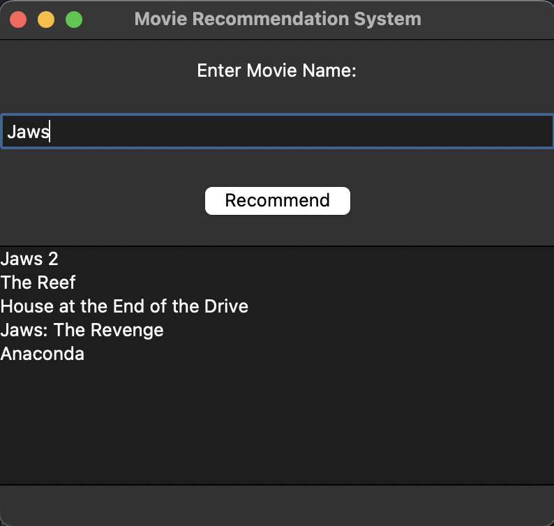
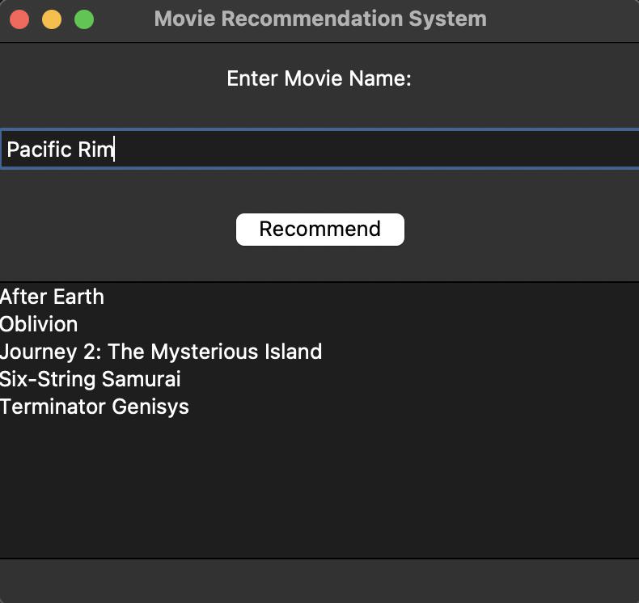
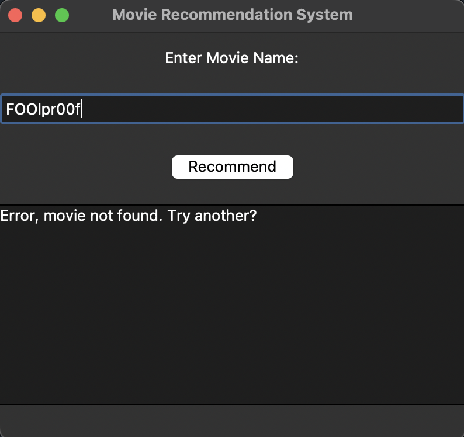

# Movie1.0 Recommendation System

The larger framework of this project is made by following similar pre-made projects on Youtube, however, I did also make lots of changes myself, such as adding a class, cleaning and organizing redundant/inefficient code, and also a graphic interface using Tkinter. I thought about also implementing a crawler that goes through real movie databases rather than a downloaded one such as IMBD, but it is rather difficult as at this moment I don't know how to bypass their anit-crawling measures yet. Maybe I'll come back and pick this project up. Other than that, this was lots of fun, and I really enjoyed tuning the program myself rather than just 100% copying a tutorial.

A quick description of how its done if anyones interested is, this program feeds in data from two existing csv files (movie databases), cleans it, then starts to combine and vectorize features. The key column is then vectorized using CountVectorizer from Scikit-Learn, then the cosine similarity is computed between these vectors to measure the similarity. Then it gives recommendations.

The graphic interface looks something like this:

  
  
  

